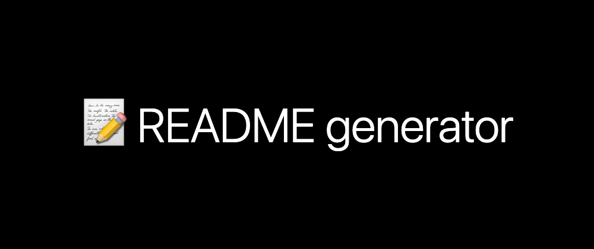

<p width="100%" align="center">
    
</p>

# Documentação README

<p id="descricao" align="justify">
Este repositório apresenta um README padronizado. Você irá ver utilização de imagens com html e markdown.

Iremos apresentar menu como tabela de conteúdo, tecnologias, badges entre outres. 
</p>

[](https://github.com/)


## Tabela de Conteúdo
<ul>
    <li><a href="#descricao">Descrição</a></li>
    <li><a href="#status">Status</a></li>
    <li><a href="#features">Features</a></li>
    <li><a href="#mapa">Mapa do Projeto</a></li>
    <li><a href="">Tecnologias</a></li>
</ul>

## :rocket: Status do Projeto
<p id="status">
    ...Em construção
</p>

## Features
<p id="features"></p>

- [X] Badges
- [X] Status
- [ ] Tecnologias

<p id="mapa"></p>

## Mapa do projeto

```.
├───images
└───temp
```


## Tecnologias